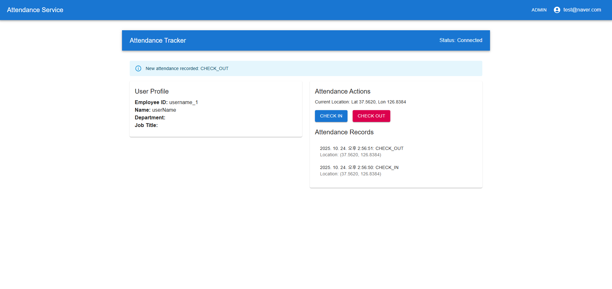

# 출결 관리 SaaS

클라우드 기반의 출결 관리 서비스입니다. 사용자는 회사에 소속되어 출퇴근을 기록할 수 있으며, 관리자는 직원을 관리할 수 있습니다.

## ✨ 주요 기능

- **사용자 인증**
  - JWT 기반의 회원가입 및 로그인 기능
  - `ADMIN`, `EMPLOYEE` 역할에 따른 접근 제어
- **출퇴근 관리**
  - 사용자의 현재 위치를 기반으로 출퇴근 기록
  - WebSocket을 통한 실시간 출퇴근 현황 업데이트
- **관리자 대시보드**
  - 회사 내 모든 직원 정보 조회
  - 직원의 생성, 정보 수정, 삭제 (CRUD)
  - 모바일/데스크탑 환경에 반응하는 UI

## 📸 스크린샷

**출결 서비스 화면**



## 🚀 현재 상태

- **회원가입 및 로그인:** 정상 작동합니다.
- **사용자 프로필 조회 (`/api/users/me`):** 정상 작동합니다.
- **WebSocket 연결:** 정상 작동합니다.
- **출퇴근 기록 조회 (`/api/attendance/{employeeId}`):** 정상 작동합니다.

## 🛠️ 기술 스택

- ### **Backend**
  - Java 17
  - Spring Boot 3
  - Spring Security (JWT)
  - Spring Data JPA (Hibernate)
  - H2 Database
  - WebSocket
  - Gradle

- ### **Frontend**
  - React
  - TypeScript
  - Material-UI (MUI)
  - Axios
  - React Router
  - StompJS & SockJS

## 🚀 시작하기

### 사전 요구사항

- Java (JDK) 17 또는 그 이상
- Node.js 16 또는 그 이상

### 1. 백엔드 서버 실행

PowerShell 또는 터미널에서 다음을 실행하세요.

```powershell
# 백엔드 폴더로 이동
cd backend

# Gradle을 사용하여 서버 실행
.\gradlew bootRun
```

서버가 `http://localhost:8080`에서 실행됩니다.

### 2. 프론트엔드 서버 실행

별도의 PowerShell 또는 터미널에서 다음을 실행하세요.

```powershell
# 프론트엔드 폴더로 이동
cd frontend

# 의존성 설치 (최초 한 번만)
npm install

# React 개발 서버 실행
npm start
```

애플리케이션이 `http://localhost:3000`에서 열립니다.

## 📝 최근 변경사항 (2025-10-24)

*   **Backend:**
    *   **보안:**
        *   `/api/admin/**` 엔드포인트에 `ADMIN` 역할 요구 사항 추가.
        *   `/api/attendance/**` 엔드포인트에 `ADMIN` 또는 `EMPLOYEE` 역할 요구 사항 추가.
    *   **관리자:**
        *   관리자가 새 사용자를 생성할 때 사용자가 관리자의 회사에 자동으로 연결되도록 수정.
        *   새로 생성된 사용자의 기본 역할을 `EMPLOYEE`로 설정.
    *   **출석:**
        *   출석 기록을 위한 WebSocket 엔드포인트를 `AttendanceController`에서 새로운 `AttendanceWsController`로 이동.
    *   **인증:**
        *   직원 ID 생성 시 사용자 이름의 공백을 밑줄로 바꾸도록 수정.
    *   **설정:**
        *   `application.properties`의 `jwt.secret` 업데이트.
        *   `WebConfig.java` 삭제.

*   **Frontend:**
    *   **출석 트래커:**
        *   WebSocket 메시지 디버깅을 위한 로그 추가.
        *   중복된 출석 기록이 추가되는 것을 방지.
        *   위치 정보 설정 변경 (정확도 낮춤, 타임아웃 증가).